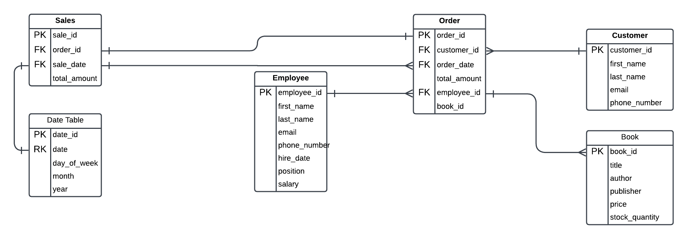
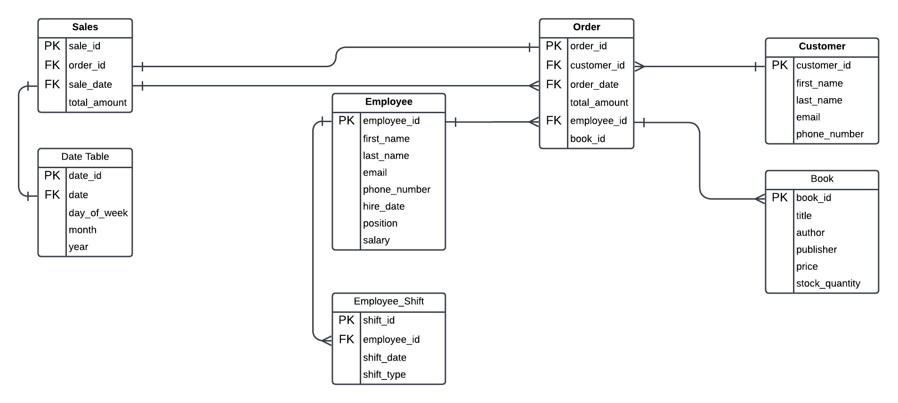
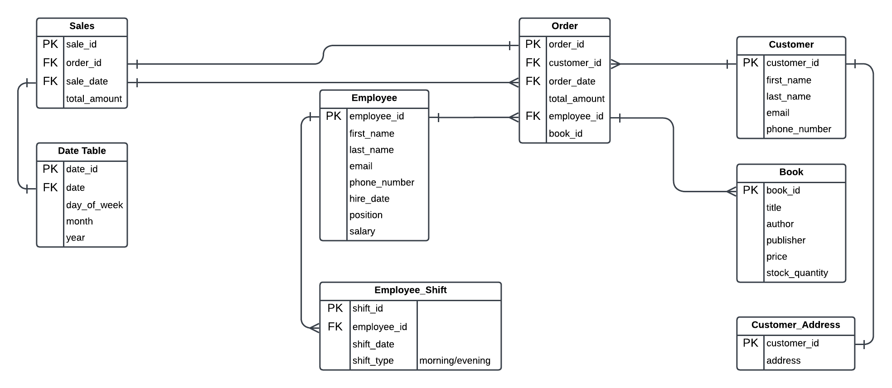
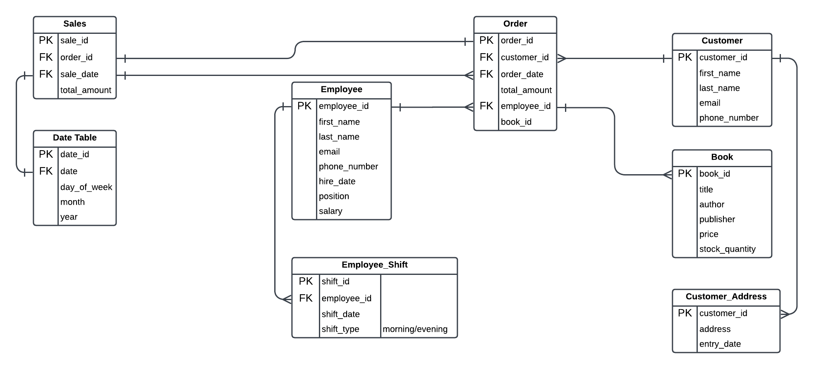

# Assignment 1: Design a Logical Model

## Question 1
Create a logical model for a small bookstore. 📚

At the minimum it should have employee, order, sales, customer, and book entities (tables). Determine sensible column and table design based on what you know about these concepts. Keep it simple, but work out sensible relationships to keep tables reasonably sized. Include a date table. There are several tools online you can use, I'd recommend [_Draw.io_](https://www.drawio.com/) or [_LucidChart_](https://www.lucidchart.com/pages/).

## Question 2
We want to create employee shifts, splitting up the day into morning and evening. Add this to the ERD.

## Question 3
The store wants to keep customer addresses. Propose two architectures for the CUSTOMER_ADDRESS table, one that will retain changes, and another that will overwrite. Which is type 1, which is type 2?

_Hint, search type 1 vs type 2 slowly changing dimensions._

### Type 1: overwrite

### Type 2: retain changes

Bonus: Are there privacy implications to this, why or why not?

Yes, there are privacy implications to storing customer addresses, especially if the database retains historical address records. This is because personal address information is sensitive, and mishandling it could lead to privacy breaches. To ensure compliance with privacy laws, it’s crucial that customers provide clear consent before their data is collected and stored. Additionally, if a customer requests their information to be deleted, the database must be capable of removing not only the current and historical address records.

## Question 4
Review the AdventureWorks Schema [here](https://i.stack.imgur.com/LMu4W.gif)

Highlight at least two differences between it and your ERD. Would you change anything in yours?

Compared to the AdventureWorks Schema, one key difference is how customer addresses are managed. In AdventureWorks, customer addresses are handled with a separate `Address` table and a linking `CustomerAddress` table. This creates a many-to-many relationship, allowing a customer to have multiple addresses, and the same address can be associated with multiple customers. For instance, a customer might have a billing address and a separate shipping address, while different customers might share a common office address. In contrast, our ERD has a simpler one-to-one relationship between customers and addresses, with address information stored directly. This limits the ability to manage multiple addresses or handle situations where different customers share the same address.

Another significant difference is how AdventureWorks manages product inventory. AdventureWorks uses a dedicated `Product` table, which is highly detailed, with fields for product category, model, and additional metadata such as weight or color. This level of detail helps track a wide range of products with specific characteristics. In our ERD, the `Book` table is much simpler, with basic fields such as title, author, and price. While sufficient for a small bookstore, this design might not scale well if we were to expand inventory to include products with more attributes, such as different editions, formats, or special categories.

# Criteria

[Assignment Rubric](./assignment_rubric.md)

# Submission Information

🚨 **Please review our [Assignment Submission Guide](https://github.com/UofT-DSI/onboarding/blob/main/onboarding_documents/submissions.md)** 🚨 for detailed instructions on how to format, branch, and submit your work. Following these guidelines is crucial for your submissions to be evaluated correctly.

### Submission Parameters:
* Submission Due Date: `September 28, 2024`
* The branch name for your repo should be: `model-design`
* What to submit for this assignment:
    * This markdown (design_a_logical_model.md) should be populated.
    * Two Entity-Relationship Diagrams (preferably in a pdf, jpeg, png format).
* What the pull request link should look like for this assignment: `https://github.com/<your_github_username>/sql/pull/<pr_id>`
    * Open a private window in your browser. Copy and paste the link to your pull request into the address bar. Make sure you can see your pull request properly. This helps the technical facilitator and learning support staff review your submission easily.

Checklist:
- [x] Create a branch called `model-design`.
- [x] Ensure that the repository is public.
- [x] Review [the PR description guidelines](https://github.com/UofT-DSI/onboarding/blob/main/onboarding_documents/submissions.md#guidelines-for-pull-request-descriptions) and adhere to them.
- [x] Verify that the link is accessible in a private browser window.

If you encounter any difficulties or have questions, please don't hesitate to reach out to our team via our Slack at `#cohort-4-help`. Our Technical Facilitators and Learning Support staff are here to help you navigate any challenges.
